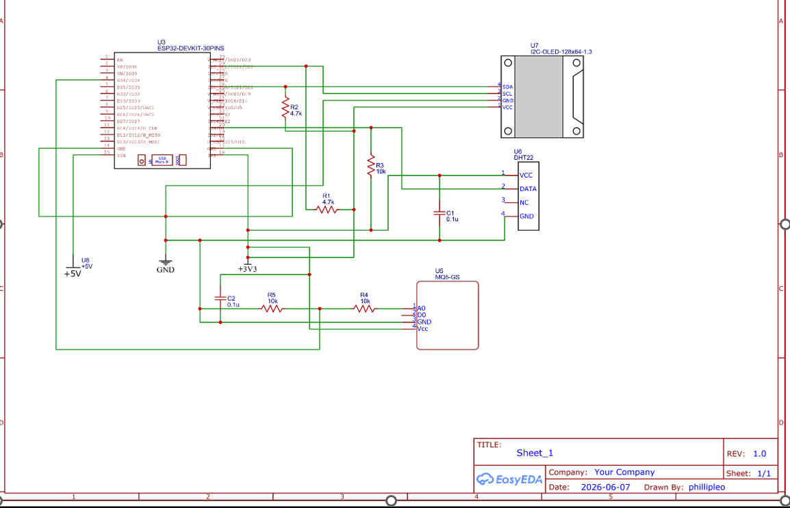
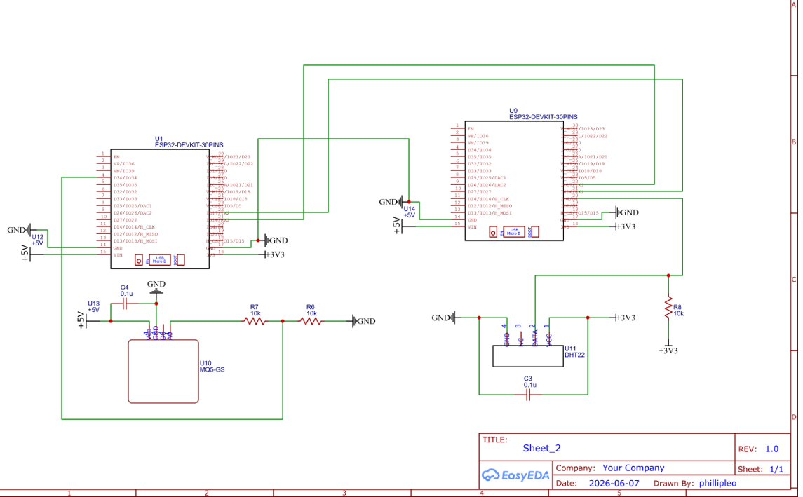
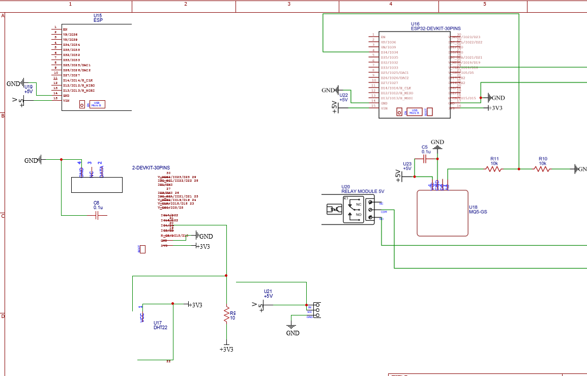

# ICS 4111 – Embedded Systems & IoT

## Semester Project – Deliverable 1

### Group Information

| Item            | Details                           |
| --------------- | --------------------------------- |
| Course          | ICS 4111 – Embedded Systems & IoT |
| Semester        | Apr – Jul 2026                    |
| Deliverable     | Deliverable 1                     |
| Flower Assigned | Rose Plant                        |
| Repository      | https://github.com/Codex-r1/Ctrl-Alt-Elite-/   |

---

# 1. Environmental Requirements for Rose Plant Growth

The environmental conditions required for healthy rose growth were researched and documented. The values obtained will be used as threshold values for the embedded monitoring system.

| Parameter             | Recommended Range                        |
| --------------------- | ---------------------------------------- |
| Optimal Temperature   | 18°C – 27°C                              |
| Relative Humidity     | 50% – 70%                                |
| Soil Type             | Well-drained loam soil                   |
| Soil Moisture Content | 20% – 40% Volumetric Water Content (VWC) |
| Soil pH               | 6.0 – 6.5                                |
| Sunlight Exposure     | 6 – 8 hours per day                      |

## Explanation of Growth Requirements

### Optimal Temperature Range (18°C – 27°C)

Roses grow best in warm environmental conditions. Temperatures within this range encourage healthy vegetative growth and flower production.

### Optimal Relative Humidity Range (50% – 70%)

Moderate humidity reduces excessive water loss while minimizing the risk of fungal diseases.

### Recommended Soil Type

Well-drained loam soil provides an ideal balance of water retention, drainage, aeration, and nutrient availability.

### Optimal Soil Moisture Content (20% – 40% VWC)

Rose plants require moist soil conditions. Excessive moisture may lead to root rot, while insufficient moisture can reduce flowering.

### Optimal Soil pH Range (6.0 – 6.5)

Slightly acidic soil improves nutrient availability and absorption by plant roots.

### Suitable Number of Hours of Sunlight Exposure (6 – 8 Hours)

Rose plants require full sunlight for healthy growth and abundant flowering.

---

# 2. Hardware Components

The following hardware components were selected to monitor environmental conditions affecting rose plant growth.

## 2.1 Microcontrollers

| Component                          | Quantity | Purpose                                                 |
| ---------------------------------- | -------- | ------------------------------------------------------- |
| ESP32S Wi-Fi + BLE Module (30-Pin) | 2        | Data acquisition, processing, communication and control |

## 2.2 Sensors

| Component                                    | Quantity | Purpose                                  |
| -------------------------------------------- | -------- | ---------------------------------------- |
| DHT22 AM2302 Temperature and Humidity Sensor | 1        | Measures temperature and humidity        |
| MQ-5 LPG Gas Sensor                          | 1        | Detects LPG, methane, propane and butane |
| Capacitive Soil Moisture Sensor v1.2         | 1        | Measures soil moisture                   |
| Analog Soil pH Sensor Module                 | 1        | Measures soil pH                         |
| BH1750 Ambient Light Sensor                  | 1        | Measures sunlight intensity              |

## 2.3 Output and Actuator Modules

| Component                 | Quantity | Purpose                                              |
| ------------------------- | -------- | ---------------------------------------------------- |
| 128×64 OLED LCD Display   | 1        | Displays sensor readings                             |
| 5V 1-Channel Relay Module | 4        | To control actuators such as irrigation pumps and fans |

## 2.4 Passive Electronic Components

| Component                   | Quantity | Purpose                     |
| --------------------------- | -------- | --------------------------- |
| 10kΩ Resistor               | 5        | Pull-up/pull-down resistors |
| 4.7kΩ Resistor              | 2        | I2C pull-up resistors       |
| 100nF Capacitor             | 3        | Noise filtering             |
| 10µF Electrolytic Capacitor | 2        | Power supply smoothing      |

## 2.5 Power Supply Components

| Component              | Quantity | Purpose                   |
| ---------------------- | -------- | ------------------------- |
| 5V USB Power Adapter   | 6        | Powers ESP32 modules and actuators      |
| USB to Micro-USB Cable | 2        | Power and firmware upload |

## 2.6 Prototyping Tools

| Component    | Quantity | Purpose                     |
| ------------ | -------- | --------------------------- |
| Breadboard   | 2        | Solderless prototyping      |
| Jumper Wires | 40       | Electrical connections      |
| Multimeter   | 1        | Testing and troubleshooting |

---

# 3. Datasheets and Technical References

## 3.1 1.3" White IIC 128×64 OLED LCD Display

**Primary Reference**

https://www.lcdwiki.com/1.3inch_IIC_OLED_Module_SKU:MC130VX

**User Manual**

https://cdn.awsli.com.br/945/945993/arquivos/1.3inch_IIC_OLED_Module_MC130GX&MC130VX_User_Manual_EN.pdf

---

## 3.2 ESP32S DevKIT Wi-Fi + BLE Module (30-Pin)

**Official Datasheet**

https://www.espressif.com/sites/default/files/documentation/esp32_datasheet_en.pdf

**Technical References**

https://www.espboards.dev/esp32/esp32-doit-devkit-v1/

https://www.circuitstate.com/pinouts/doit-esp32-devkit-v1-wifi-development-board-pinout-diagram-and-reference/

---

## 3.3 DHT22 AM2302 Temperature and Humidity Sensor

**Datasheet**

https://cdn-shop.adafruit.com/datasheets/Digital+humidity+and+temperature+sensor+AM2302.pdf

**Alternative Datasheet**

https://cdn.sparkfun.com/assets/f/7/d/9/c/DHT22.pdf

---

## 3.4 MQ-5 LPG Gas Sensor

**Datasheet**

https://www.winsen-sensor.com/d/files/MQ-5.pdf

**Alternative Datasheet**

https://files.seeedstudio.com/wiki/Grove-Gas_Sensor-MQ5/res/MQ-5.pdf

---

## 3.5 5V 1-Channel Low Level Trigger Relay Module

**Datasheet**

https://handsontec.com/dataspecs/relay/1Ch-relay.pdf

**Product Reference**

https://thinkrobotics.com/products/1-channel-relay-module-shield-5v

---

# 4. System Architecture Designs

## Architecture A

### ESP32S Connected to MQ-5, DHT22 and OLED LCD

### Design Notes

* DHT22 connected using a 10kΩ pull-up resistor.
* MQ-5 connected to ESP32 ADC input.
* OLED display connected through I2C interface.
* Decoupling capacitors included for stable operation.

---

## Architecture B

### ESP32S Connected to MQ-5 Interfaced Directly with Another ESP32S Connected to DHT22

### Design Notes

* ESP32 devices communicate directly.
* DHT22 uses a pull-up resistor.
* Capacitors included for noise suppression and voltage stability.

---

## Architecture C

### ESP32S Connected to DHT22 and Relay Connected to Another ESP32S with MQ-5

### Design Notes

* Relay provides isolation between subsystems.
* MQ-5 connected to ADC input.
* DHT22 uses pull-up resistor.
* Capacitors included for power stabilization.

---

# 5. Evidence of Group Work

## Work distribution

---

## Task Allocation

| Team Member | Responsibility                          |
| ----------- | --------------------------------------- |
| Phillip Gakuo  | Flower research                         |
| Abucheli Ronah   | Hardware selection                      |
| Danny Podho   | Datasheet research                      |
| Phillip Leo    | Circuit schematic development           |
| Njihia Muranga   | Documentation and repository management |

---

# 6. Conclusion

This deliverable identified the environmental requirements necessary for healthy rose plant growth and selected suitable embedded hardware for monitoring those conditions. Relevant datasheets were collected and three alternative embedded system architectures were developed to support implementation of the final IoT-based monitoring solution.

---

# References

1. Carvalho, S. M. P., Heuvelink, E., Cascais, R., & Van Kooten, O. (2014). Effect of day and night temperature on internode and flower development in rose. HortScience, 49(6), 741–746.

2. Compost Check. (2025). Rose Watering Guide: Tips for Healthy Blooms.
