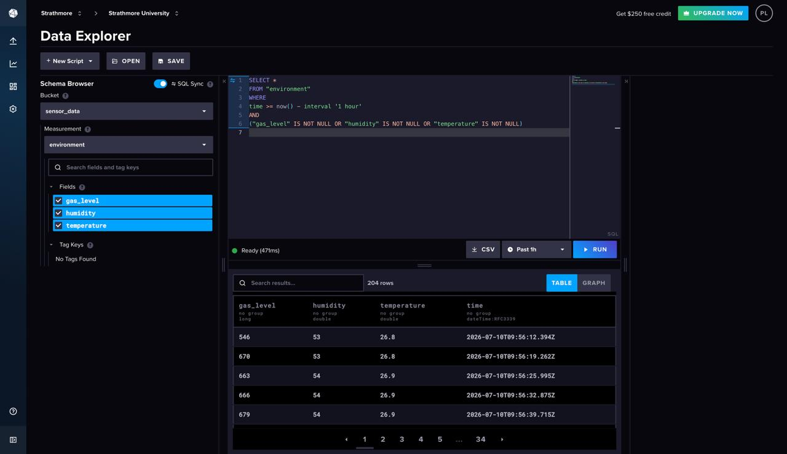
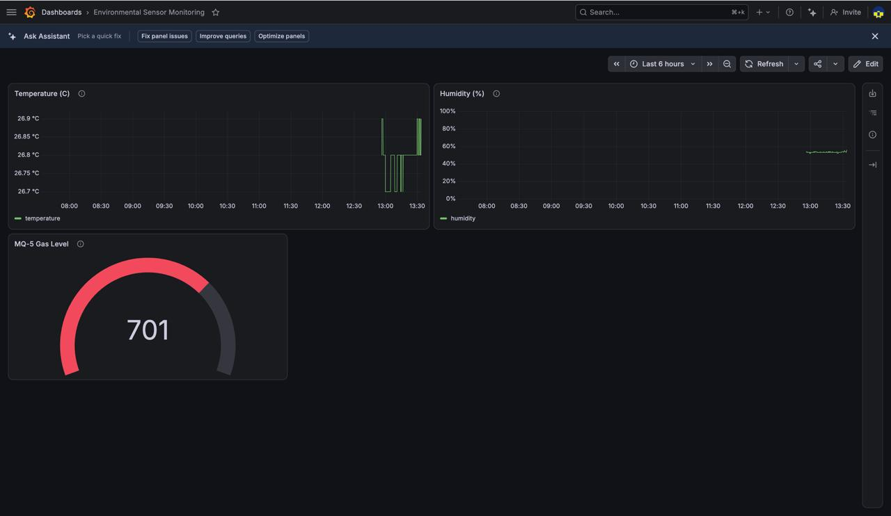

# IoT Environmental and Gas Monitoring System

## Project Overview

This project implements an Internet of Things (IoT) environmental monitoring system using an ESP32S microcontroller, an MQ-5 gas sensor, a DHT22 temperature and humidity sensor, and an I2C LCD display. The ESP32 collects sensor readings, displays them locally on the LCD, transmits the data to InfluxDB for time-series storage, and visualizes the collected data using Grafana.

---

# Device Architecture

The system consists of the following hardware components:

- ESP32S
- MQ-5 Gas Sensor
- DHT22 Temperature and Humidity Sensor
- I2C LCD Display
- Breadboard
- Jumper Wires

The ESP32 reads environmental data from the sensors, displays the readings on the LCD, and sends the measurements over Wi-Fi to InfluxDB. Grafana connects to InfluxDB and visualizes the data using real-time dashboards.

---

# Physical Prototype

The physical prototype was assembled using an ESP32 development board connected to the MQ-5 gas sensor, DHT22 sensor, and an I2C LCD display.


**Figure 1:** Completed physical implementation of the IoT monitoring system.

---

# Arduino Implementation

The ESP32 firmware was developed using the Arduino IDE. The program performs the following operations:

1. Initializes the ESP32 peripherals.
2. Connects the ESP32 to a Wi-Fi network.
3. Reads temperature and humidity values from the DHT22 sensor.
4. Reads gas concentration values from the MQ-5 sensor.
5. Displays sensor readings on the LCD.
6. Sends all measurements to InfluxDB.
7. Repeats the process continuously.


**Figure 2:** Arduino implementation and hardware setup.

---

# Wi-Fi Communication

The ESP32 successfully connects to the configured wireless network before transmitting sensor readings to the cloud database.


**Figure 3:** Serial monitor showing successful Wi-Fi connection and sensor data transmission.

---

# InfluxDB Integration

Sensor readings are transmitted to InfluxDB where they are stored as time-series data.

Each record contains:

- Temperature
- Humidity
- Gas Level
- Timestamp

The screenshot below shows the stored sensor readings in the InfluxDB Data Explorer.



**Figure 4:** Sensor data successfully stored in the InfluxDB time-series database.

---

# Grafana Dashboard

Grafana was configured to use InfluxDB as its data source. A dashboard containing three visualizations was created to monitor the environmental conditions in real time.

The dashboard contains:

- Temperature visualization
- Humidity visualization
- MQ-5 gas level visualization



**Figure 5:** Grafana dashboard displaying live sensor readings.

---

# Dashboard Visualizations

The Grafana dashboard includes the following visualizations:

## Temperature

Displays the temperature values collected by the DHT22 sensor over time.

## Humidity

Displays humidity measurements collected by the DHT22 sensor.

## MQ-5 Gas Level

Displays gas concentration measured by the MQ-5 sensor using a gauge visualization.

The complete dashboard containing all three visualizations is shown in Figure 5.

---

# Cloud Platform

## InfluxDB

InfluxDB was used as the time-series database for storing sensor measurements.

Stored measurements include:

- Temperature
- Humidity
- Gas Level
- Timestamp

## Grafana

Grafana was connected to InfluxDB to visualize the collected sensor data using interactive dashboards.

---

# Results

The implemented IoT system successfully achieved the following objectives:

- Successfully interfaced the ESP32 with the DHT22 sensor, MQ-5 sensor, and LCD.
- Displayed live sensor readings on the LCD.
- Connected the ESP32 to a Wi-Fi network.
- Transmitted sensor readings to InfluxDB.
- Stored measurements in a time-series database.
- Visualized the collected data using Grafana.
- Created three dashboard visualizations for temperature, humidity, and gas concentration.

---

# Group Members

The project was implemented collaboratively by the project team.


**Figure 6:** Project team after successful implementation and testing.

---

# Repository Contents

```
.
├── README.md
├── Physical implementation.jpeg
├── arduino implementation.jpeg
├── Wi-Fi module working terminal.jpeg
├── influxDB.jpeg
├── Graphana.jpeg
└── D3 groupPhoto.jpeg
```

---

# Conclusion

This project demonstrates the implementation of a complete IoT monitoring solution using an ESP32 microcontroller. Environmental data collected from the MQ-5 and DHT22 sensors is displayed locally, transmitted to InfluxDB for storage, and visualized in Grafana through real-time dashboards. The system successfully integrates sensing, wireless communication, cloud storage, and data visualization into a single IoT application.
